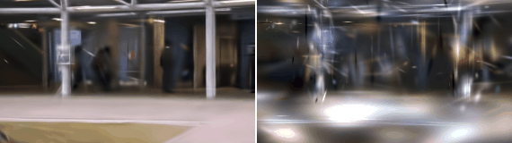
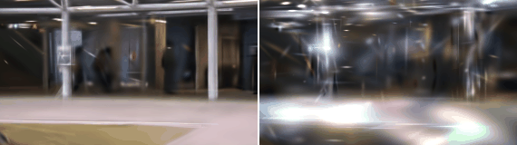
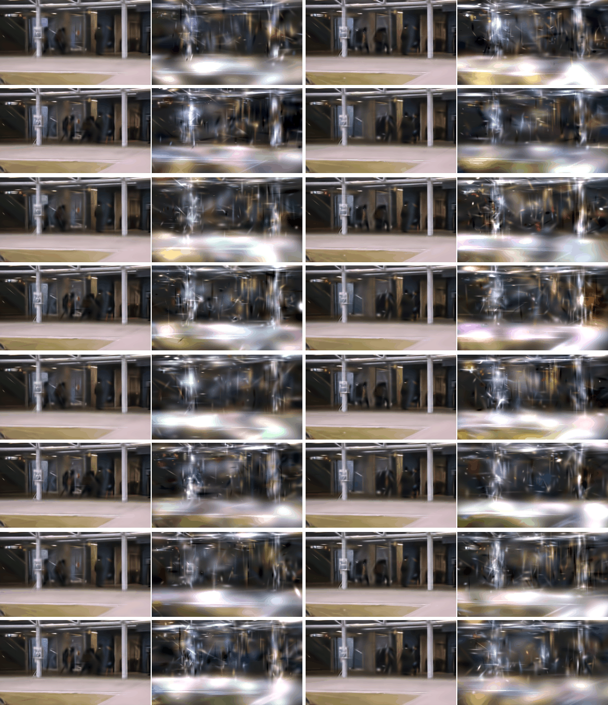
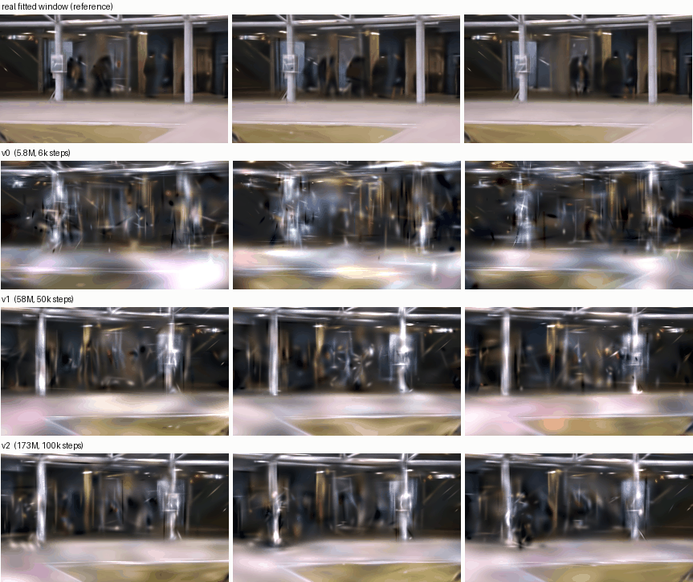

# jewels

**Video as a set of spacetime primitives — and video *generation* as emitting them.**

A video is treated as a 3D volume in (u, v, t), not a frame sequence. It is represented by
N anisotropic Gaussian primitives ("jewels") whose orientation tilted into the time axis
encodes velocity — a moving object is one sheared spacetime tube, not a new blob per frame.
Generation is then a set problem: a permutation-invariant flow-matching transformer emits
primitive sets from noise, conditioned on CLIP embeddings. Rendering the emitted set into
frames is deterministic and nearly free.

Why bother, when latent-pixel diffusion works? Because this representation gets structurally
what frame-based models pay for continuously:

- **Temporal coherence by construction** — there are no frames to flicker between; every
  primitive is a smooth spacetime object.
- **Unbounded length** — video continues as long as the model keeps emitting jewels; there is
  no fixed canvas. (Windowed autoregression along t; window length and time units are frozen
  corpus-wide constants.)
- **Compute scales with content, not pixels × frames** — and a 64-frame, 6,471-primitive
  window is a ~600 KB file that decodes in real time.
- **Editability** — move, recolor, or delete an object by editing its primitives; no
  inpainting model in the loop.

Per-clip *fitting* of such representations is established art (GSVC, VeGaS, GaussianVideo).
The bet here is the generative stage on top of fitted corpora — which, as of this writing,
appears to be an open lane (closest relatives: L3DG and GaussianCube diffuse over *3D object*
Gaussians; the 2025–26 "generative splatting" wave runs the opposite direction, using pixel
video diffusion as a prior for 3D).

## What works today

### 1. The falsification test
A moving blob is literally a sheared tube in (u,v,t). If a handful of anisotropic primitives
couldn't fit this near-perfectly, the whole premise would be dead. (Panel shows the early
additive-vs-Voronoi A/B; the Voronoi arm lost every measured axis even after a steelman round
and was removed — see `PROJECT.md`'s decision log for the full burial.)


### 2. Real-footage fitting at corpus scale
One 64-frame window of CUHK Avenue (fixed street camera), fit with ≤10k primitives in ~2.3
minutes: **[ground truth | fit]**. A 231-window corpus fit overnight on one RTX 4090; fits on
real footage are strongly anisotropic (median ~3), i.e. the motion-in-orientation premise is
doing real work.


### 3. Generated video — sampled from noise, decoded, rendered
A 5.8M-parameter set-flow transformer (no positional encodings — the distribution is
permutation-invariant), trained 37 minutes on the 231-window corpus, CLIP-conditioned with
classifier-free guidance. Each pair: **[real fitted window | generated sample]**.




Scene layout, palette, and per-dimension feature marginals match the corpus within a few
percent; fine detail is v0-grade fever dream. Note what is *already* free: the samples are
temporally stable — no flicker — because coherence lives in the representation, not the model.



**v1** (58M params, 50k steps / 2.7 h, EMA, bf16, mirror-augmented corpus) sharpens the story
considerably — pillars, notice board, ceiling beams, floor geometry, and pedestrian figures
all present and temporally stable:


### 4. The scaling curve — three models, one frozen protocol

v0 (5.8M) → v1 (58M) → v2 (173M), identical corpus and recipe, scored by CLIP-Fréchet
distance between generated renders and fitted renders under a fixed sampling protocol:




Monotone on both metrics (CFD 0.31 → 0.20 → 0.16; loss 1.148 → 1.066 → 0.993), with a
visibly flattening slope — **model scaling saturates against a 231-window single-scene
corpus**, which makes data the measured next axis (a 2,392-scene Sky Timelapse corpus is
fitting now). A second measured constraint: current fits carry ~1.3k active splats per frame
(~2.2k parameters/frame) — the "low splat count" regime of the image-splatting literature,
which is exactly the softness visible above. Raising fit density toward 5–10k active
splats/frame (24k–45k per window) is the current stage-1 priority; the prior-side cost of
those larger sets is what the jewel tokenizer exists to absorb.

### Numbers so far

| measurement | result |
|---|---|
| synthetic tube fit | ~55 dB PSNR |
| real busy scene fit (160px, ≤10k prims) | ~30 dB PSNR |
| cross-seed canonicality (chamfer ratio vs random baseline) | 0.62 — weakly canonical: set priors viable, autoregression over the set ruled out |
| featurization round-trip (log-covariance coords) | 1e-6 max error |
| v0 prior | 6k steps, loss 1.14 vs 2.0 no-skill baseline |

## Research trajectory

- [x] **Stage-1 fitter** — additive anisotropic spacetime Gaussians, stochastic-voxel
  training (VRAM flat in clip length), gradient-driven densify / weight prune
- [x] **Canonicalization measurement** — the go/no-go for a generative stage; also hosted the
  additive-vs-Voronoi A/B and steelman (background pseudo-cell + Lloyd relaxation; Voronoi
  lost reconstruction *and* canonicality and was removed)
- [x] **Corpus pipeline** — resumable window fitting + CLIP embedding sidecars
  (`cli/fit_corpus.py`, `cli/label_corpus.py`); 231-window Avenue corpus, 134 MB
- [x] **v0 set prior** — gauge-free featurization (log-covariance, verified lossless),
  `SetDiT` flow matching, CLIP conditioning with dropout → first jewel-emitted videos
- [ ] **v1 dense run** — 58M params, EMA, bf16, mirror augmentation *(training now)*
- [ ] **Jewel tokenizer** — set VQ-autoencoder → latent set diffusion. Breaks the O(N²)
  attention wall for higher resolution AND realizes the original "vocabulary of quantized
  anisotropies" thesis. (The 3D precedent — L3DG, GaussianCube — says structured/latent
  space is where primitive diffusion starts to really work.)
- [ ] **Renderer speedup** (chunked culling, torch.compile, then a tile rasterizer) →
  **UCF-101 class-conditional corpus** → FVD against published academic baselines
  (DIGAN / StyleGAN-V / Latte lineage)
- [ ] **Text prompting** — the CLIP text encoder drops into the existing conditioning
  interface; becomes meaningful with class captions, real with diverse captioned data
- [ ] **OpenVid subset** → open-vocabulary t2v (the fitter doubles as a static-camera filter)
- [ ] **Windowed autoregression** → unbounded-length generation (corpus already records
  absolute window offsets for overlap conditioning)
- [ ] **Amortized encoder** — feedforward video → jewels, replacing per-clip optimization at
  data scale (training pairs are self-generated by the fitter)
- [ ] **Hybrid pixel refiner** — jewels as structural/temporal backbone + thin appearance
  refiner at decode, if/when the fidelity ceiling of pure primitives binds

## Quickstart

```bash
pip install torch numpy av pillow          # + open-clip-torch for labeling

cd stprim
python cli/fit_video.py --synthetic                          # falsification test
python cli/fit_video.py --video clip.mp4 --frames 64 --size 160
python cli/render_recon.py --video clip.mp4                  # fit + GIF/contact sheet
python experiments/canonicalization.py --video clip.mp4      # two-seed gauge check

python cli/fit_corpus.py --videos 'data/*.avi' --out corpus/mine
python cli/label_corpus.py --corpus corpus/mine
python cli/train_prior.py --corpus corpus/mine --out prior/v1 --flip-u
python cli/sample_prior.py --ckpt prior/v1/prior.pt --corpus corpus/mine --out samples
```

Fixed camera, no cuts, for now — global camera motion shears every primitive at once and is
future work (camera tokens), not a supported input.

## Design record

Every module has a companion `.md` documenting intent, contracts, and rationale; the project
log with all decisions (including the full Voronoi post-mortem) lives in
[PROJECT.md](PROJECT.md). The pre-removal tree with the Voronoi implementation is archived in
this repo as `stprim-final-with-voronoi-20260731.tar.gz`.
