# Jewels

**A promptable video model that speaks persistent Gaussian programs directly into spacetime.**

A video is treated as a continuous volume in $(u,v,t)$, not as a stack of unrelated frames. It is
rendered from irregular anisotropic Gaussian primitives called **Jewels**. A Jewel tilted into the
time axis behaves like a moving colored tube: motion is part of its geometry, and temporal
coherence comes from the representation itself.

## The headline result: a native promptable model exists

This project now has a bounded but genuine prompt-to-video path:

~~~text
prompt + integer seed
  -> exact compiler or 541k-parameter learned speaker
  -> scene + persistent foreground/background trajectory tokens
  -> addressed local phrases
  -> K=1024 covariance, surface-color, and color-gradient tokens
  -> exact continuous centroids
  -> irregular 72,000-Jewel spacetime field
  -> support-complete additive renderer
  -> 49-frame video
~~~

The passing exact system receives **only prompt text and a declared seed**. At inference it receives
no target video, target Jewel field, block program, held-out latent, Cartesian output grid, or
pretrained-video scaffold. It does not retrieve a complete fitted video. It chooses two distinct
trajectory programs, gives foreground and background persistent ownership, casts their physical
tokens at continuous centroids, and renders the resulting field.

That is already remarkable given the training inventory:

- **3 prompt classes:** ballerina, golden retriever, and welder.
- **18 fitted training fields:** only six per class.
- **9 evaluated prompt/seed programs:** three prompts by three seeds.
- **72,000 Jewels per generated field.**
- **49 frames at 144×216** per rendered video.

Across all nine exact prompt-only programs:

| Test | Result |
|---|---:|
| Correct text beats cyclic-shuffled generation | **9/9** |
| Correct text beats null-text generation | **9/9** |
| Strict three-way OpenCLIP top-1 | **8/9** |
| Prompt classes with majority retrieval | **3/3** |
| Mean correct similarity | **0.18173** |
| Mean cyclic-shuffled similarity | 0.12525 |
| Mean null-text similarity | 0.14825 |
| Correct-minus-shuffled margin | **+0.05648** |
| Correct-minus-null margin | **+0.03348** |
| Grid-center locking | **0** |

All programs use two distinct source-backed macro tokens at exact 50/50 ownership. The subject
changes when the prompt is cyclically shuffled, which is the causal result that matters: prompt
text is selecting the generated native Jewel program rather than merely labeling a fixed render.

### Three prompts, three native Jewel programs

These are prompt-only renders from the same declared seed. They are not source-video
reconstructions: the exact speaker compiled each prompt into a native Jewel program and the
support-complete renderer produced the 49-frame result. Click any GIF for the original MP4.

| Ballerina | Golden retriever | Welder |
|:---:|:---:|:---:|
| [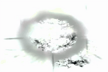](sol/results/jewel_prompt_demo_v1/generated/a-ballerina-spinning-a-pirouette-in-seed20260914-exact-940a8520810e.mp4) | [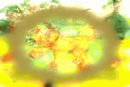](sol/results/jewel_prompt_demo_v1/generated/a-golden-retriever-catching-a-ball-seed20260914-exact-5e3ffe08b31a.mp4) | [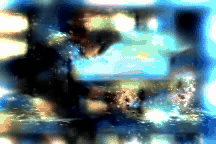](sol/results/jewel_prompt_demo_v1/generated/a-welder-joining-steel-with-bright-seed20260914-exact-c4522ccdb03d.mp4) |
| “A ballerina spinning a pirouette” | “A golden retriever catching a ball” | “A welder joining steel with bright sparks” |

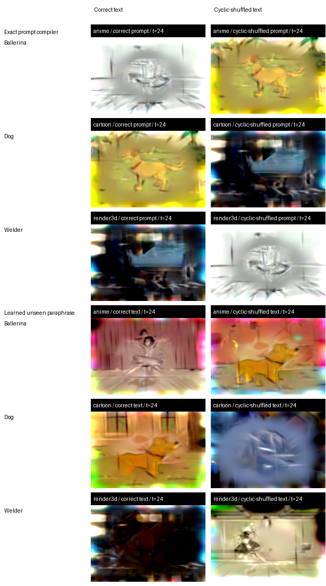

## The tiny learned speaker is also real

The exact compiler proves the full prompt-to-program-to-render path. A separate learned experiment
asks whether that program syntax can be learned instead of hand dispatched.

The speaker is a **541,223-parameter autoregressive network**:

~~~text
text -> scene token -> foreground owner -> background owner
~~~

It trains on only **216 program examples** derived from the same 18 fitted fields. Training language
contains each exact prompt plus two paraphrases per class; evaluation uses a fourth paraphrase that
the model never saw.

| Held-out text condition | Token NLL | Scene accuracy |
|---|---:|---:|
| Correct unseen paraphrase | **2.2005** | **100%** |
| Cyclic-shuffled paraphrase | 4.3870 | 0% |
| Null text | 2.5391 | 33.3% |

Every one of the nine correct-text samples emits a scene-consistent program. In rendered space,
correct text beats shuffled text in **7/9**, with mean margins of **+0.04782** over shuffled and
**+0.04117** over null.

The stricter rendered top-1 gate remains failed at **4/9**, and the README does not hide that. The
important low-data result is that a half-million-parameter model learned the coarse native program
language and generalized scene selection to unseen wording at all. Its best held-out checkpoint
occurred at step 100; training continued through step 1,100 without improvement, so the next move is
a better reusable vocabulary and rendered supervision, not simply more steps on the same target.

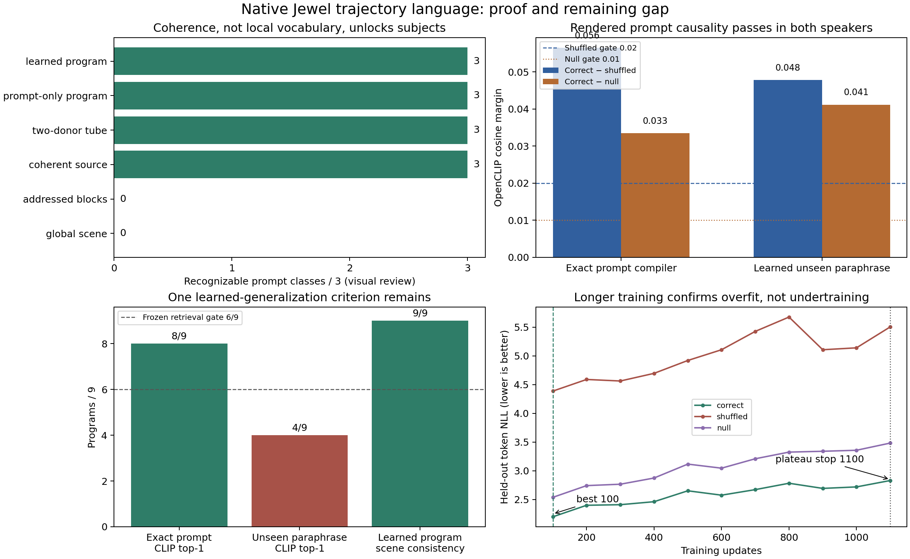

## Why the data efficiency is encouraging

Three independent results say that more data and compute have a plausible mechanism to improve this
system rather than merely making the current demo larger.

### 1. The representation really uses time distortion

Full spacetime covariance was compared with a matched control whose space/time terms were projected
to zero after every update. Primitive counts, parameter bytes, and optimization budgets were
matched across three sources and three seeds.

- Free time tilt won **9/9** paired fits.
- Mean improvement was **+0.772 dB**.
- The paired 95% interval was **[+0.573, +0.971] dB**.
- The effect was stronger on higher-motion sources.

Time-tilted Jewels are therefore doing causal representational work; they are not decorative
metadata attached to a conventional frame model.

### 2. The encoder improves monotonically with tiny datasets

A 5.26M-parameter amortized video-to-Jewel encoder was trained on exact nested subsets of 12, 60,
and 120 videos. Every budget used three independent seeds and the same frozen 60-video validation
inventory.

| Training videos | Held-out PSNR | 95% interval | LPIPS | Layout PSNR | Median mixed tilt |
|---:|---:|---:|---:|---:|---:|
| 12 | 21.876 dB | [21.751, 22.000] | 0.4728 | 29.812 dB | 0.0479 |
| 60 | 22.399 dB | [22.344, 22.453] | 0.4651 | 30.726 dB | 0.0725 |
| 120 | **22.628 dB** | **[22.459, 22.797]** | **0.3916** | **31.533 dB** | **0.1875** |

Every 120-video seed beats every 60-video seed. From 60 to 120 examples, LPIPS falls **15.8%** and
mixed space/time tilt grows **2.58×** instead of collapsing toward axis-aligned grid dots. The
per-video teacher remains far ahead at 27.699 dB and 0.1720 LPIPS, leaving visible headroom.

The same encoder preserves prompt information through a deliberately conservative
text-to-video-to-encoder control: correct text beats shuffled text in **12/12** held-out actions and
retains **91.4%** of the source video's text alignment. This is semantic-preservation evidence, not
part of the native prompt-only generation claim.

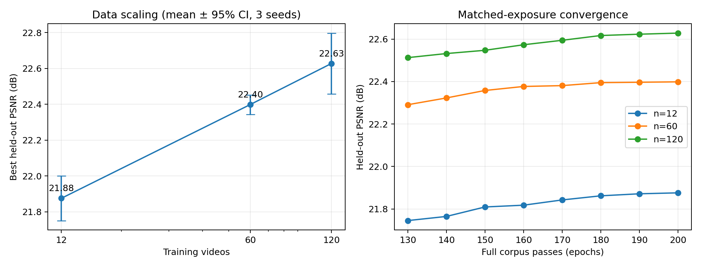

### 3. A compact physical language preserves irregular Jewel fields

The active physical vocabulary uses three independent books of 1,024 entries:

- covariance and spacetime orientation;
- base or surface color; and
- the local RGB color Jacobian.

Centroids remain continuous rather than being quantized into a visible lattice. On the active
Gate 0f audit:

| Physical-language measurement | Result |
|---|---:|
| Token-only reconstruction | **22.8657 dB** |
| Teacher mixed-tilt retention | **1.0415×** |
| Grid-center locking | **0** |
| Decisions for an eight-frame field | **35,265** |
| Same-source vs different-source canonicality margin | **+0.2243** |

This matters because the speaker need not emit 72,000 unrelated 22-float records. It can speak a
hierarchical program that expands into a continuous irregular field.

### 4. Appearance learning improves quickly and repeats across seeds

With geometry frozen bit-for-bit, the derivative appearance head continues to improve well beyond
the original 400-update screen:

| Updates | Derivative LPIPS, seed 0 | Derivative LPIPS, seed 1 |
|---:|---:|---:|
| 400 | 0.71745 | -- |
| 4,000 | 0.67037 | 0.66898 |
| 8,000 | 0.65967 | 0.66054 |
| 12,000 | **0.65895** | **0.65953** |

At 12k updates the two seeds differ by only **0.00058 LPIPS** and **0.00041 dB PSNR**. Both end near
20.835 dB, all five audited visual styles improve, and the Jewel geometry remains bit-identical.
The curve shows real compute scaling followed by a clear plateau around 8k–12k updates. That is a
much stronger conclusion than the original extremely short run.

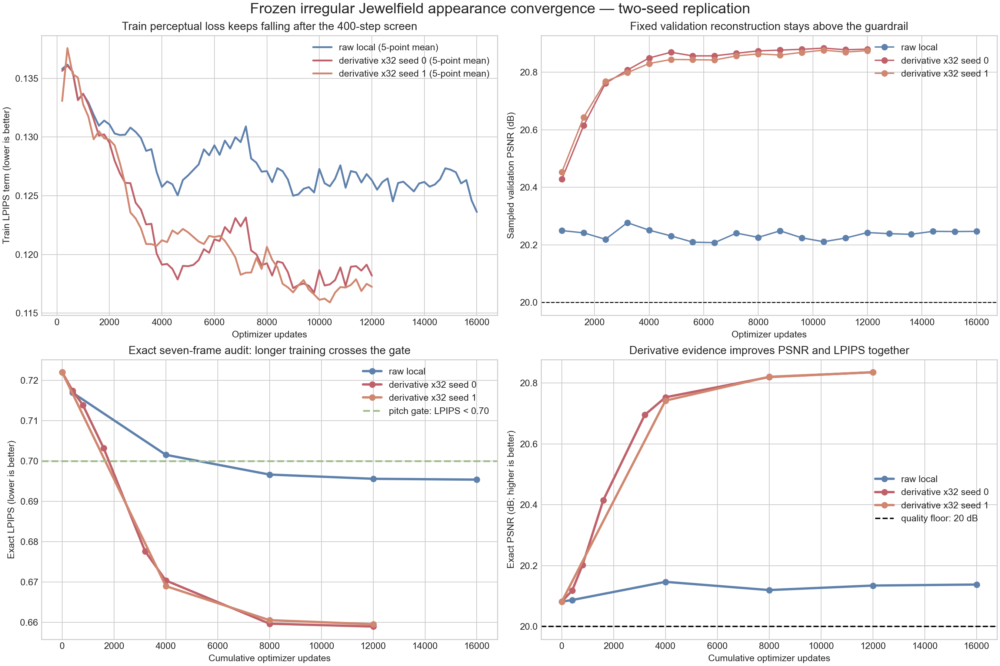

### 5. The correct renderer is already practical at proof scale

The support-complete tiled renderer checks every Jewel whose exact Mahalanobis support reaches a
query tile instead of silently keeping only a fixed number of nearby centers. At 10k, 45k, and 72k
Jewels it remains within roughly **2×** the old nearest-neighbor renderer. The 72k case uses 8.01 GB
peak allocation on an RTX 4090, and pixels and gradients agree with dense evaluation up to the
declared five-sigma truncation. This removes renderer approximation as an explanation for the
prompt-language result.

## What made promptability work

The decisive discovery was not a bigger model. It was **persistent semantic ownership**.

| Architecture | Token result | Recognizable classes |
|---|---:|---:|
| Independent global scene decoder | NLL 6.1234 | 0/3 |
| Addressed 16×16×8 local phrases | NLL 5.1680, 15.6% better | 0/3 |
| One coherent source owner through spacetime | source-disjoint controls pass | **3/3** |
| Two-donor foreground/background trajectory tube | new composition | **3/3** |
| Exact prompt trajectory compiler | 8/9 retrieval; all causal gates pass | **3/3** |
| Learned unseen-paraphrase speaker | 3/3 scene prediction; top-1 gate 4/9 | **3/3 visually** |

Local phrases learned better statistics but produced texture without a subject. Once one owner
persisted along a spacetime trajectory, recognizable subjects returned. A later two-donor system
combined foreground from one field with background from another, showing that complete-field
retrieval is not the only coherent mode.

The intended full model should therefore speak typed scene, object, background, and trajectory
operations. It should not autoregress thousands of independent low-level Jewels.

## What a spacetime Gaussian Jewel is

For query $\mathbf{x}=(u,v,t)$, Jewel $i$ contributes

$$
a_i(\mathbf{x})=\sigma(\ell_i)
\exp\left[-\frac{1}{2}(\mathbf{x}-\boldsymbol\mu_i)^\top
\boldsymbol\Sigma_i^{-1}(\mathbf{x}-\boldsymbol\mu_i)\right]
$$

with local color

$$
\mathbf{c}_i+\mathbf{J}_i(\mathbf{x}-\boldsymbol\mu_i).
$$

One Jewel has 22 continuous parameters: 3 center coordinates, 6 covariance coordinates, 1 opacity,
3 base-color values, and a 3×3 color Jacobian. Rendering is additive and deterministic. A fixed-time
slice through all Jewels produces one frame.

The covariance can tilt through time, so a single primitive can trace coherent motion across many
frames. There is no need to rediscover the same point independently in every frame.

## Why use Jewels?

Jewels are **not** being proposed as a codec, and this project does not claim an inherent compression
advantage. The opportunity is executable persistent state:

- **Temporal coherence by construction:** the video is one continuous spacetime object.
- **Irregular continuous geometry:** centroids are not locked to a pixel or voxel lattice.
- **Persistent ownership and identity:** state can carry from one temporal window to the next.
- **Local editability:** a future system can move, recolor, replace, or delete bounded regions of
  explicit state.
- **Content-dependent computation:** the representation can eventually allocate primitives where
  change and detail require them.
- **A native multimodal language target:** a transformer can emit structured visual operations
  rather than only dense raster latents.

Per-video Gaussian fitting is established work. The research bet is that a model can generate and
edit these persistent operations natively.

## Honest boundary of the current proof

The result is a **bounded promptable model**, not a production or open-vocabulary text-to-video
system.

- The semantic domain contains only three prompt families.
- The macro vocabulary contains 18 source-backed trajectory programs.
- Foreground and background are newly composed, but their macro tokens still expand from fitted
  training fields.
- The trajectory path is class-level rather than freely generated object motion.
- Local appearance remains soft and sparkly.
- Long-window identity carry, camera control, multiple objects, counting, and relationships remain
  untested.
- The learned speaker passes scene and causal-margin tests but fails the strict rendered top-1 gate.

These limitations define the next experiment; they do not erase the surprising fact that native
prompt-to-program-to-Jewel-to-video execution works at all with this little data.

## Next conclusive experiment

Replace source IDs with **64–256 reusable foreground/background trajectory prototypes** learned
across at least 100 fitted fields and 10–20 compositional prompts. A small program transformer then
emits scene, object, path derivative, background, and local residual tokens.

The next gate should be frozen before generating the corpus:

1. hold out complete object/action combinations rather than only paraphrases;
2. require correct text to beat cyclic object and action swaps in rendered metrics and blinded
   recognition;
3. forbid emitted macro tokens from referencing a source ID or copying more than a registered
   fraction of any one field;
4. require multiple recognizable but structurally different samples per prompt;
5. continue a second temporal window using only carried program and Jewel state; and
6. compare against parameter-matched direct-continuous and dense-latent baselines.

Passing that gate would support the pitch claim: prompt breadth and visual quality improve as
reusable trajectory vocabulary, paired data, and program-model compute scale.

## Paper and evidence

- [NeurIPS 2026 concept-and-feasibility paper](output/pdf/jewels_neurips2026_concept_feasibility.pdf)
- [Editable paper source](paper/neurips2026/main.tex)
- [Promptable trajectory-language proof report](sol/results/jewel_casting_language_v0/TRAJECTORY_SPEAKER_REPORT.md)
- [Support-correct encoder scaling report](sol/results/encoder_convergence_v2_continued/README.md)
- [Full technical progress report](output/pdf/jewels_progress_report.pdf)

The paper uses the official anonymous NeurIPS 2026 style. Its main claim is intentionally narrow:
prompt and seed can select a hierarchical source-backed native Jewel program and render a
prompt-selective video without a target video or field at inference.

## Run the prompt demo

The browser demo loads only the frozen Jewel language, speaker, and renderer. It may reuse an
environment that also contains LTX dependencies, but it does not import LTX or load diffusion
weights.

~~~bash
python -m sol.prompt_video_demo --host 127.0.0.1 --port 7860 --device cuda:0
~~~

Then open http://127.0.0.1:7860. The interface exposes exact and learned experimental modes, seed
control, a video player, MP4 download, and the emitted program provenance.

To export videos without the browser:

~~~bash
python -m sol.render_prompt_video \
  --output-dir sol/results/jewel_prompt_demo_v1/generated \
  --mode exact \
  --seed 20260914 \
  --prompt "a golden retriever catching a ball on grass"
~~~

The demo is experimental and requires the frozen model artifacts documented in
[the demo report](sol/results/jewel_prompt_demo_v1/README.md).

## Earlier experimental history

The repository retains earlier eras because failed configurations are useful evidence when their
scope is stated correctly.

### Representation falsification test

A moving blob is literally a sheared tube in $(u,v,t)$. The additive representation fits the
synthetic target near perfectly; a steelmanned Voronoi alternative lost every measured axis and was
removed.

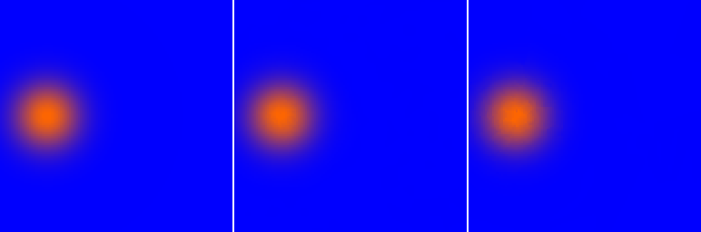

### Real-footage fitting

One 64-frame CUHK Avenue window was fit with at most 10k primitives in roughly 2.3 minutes. A
231-window corpus was fitted overnight on one RTX 4090. Real-footage Jewels are strongly
anisotropic, consistent with motion being carried by orientation.

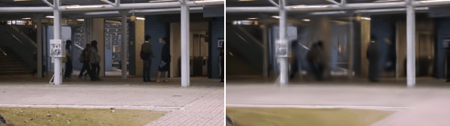

### Early set-flow generation

A 5.8M-parameter permutation-invariant set-flow model trained for 37 minutes on the 231-window
single-scene corpus. Larger 58M and 173M versions improved monotonically, then flattened against the
small single-scene dataset. These experiments established data as the next axis but did not provide
the semantic ownership needed for the current promptable model.

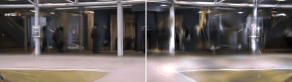

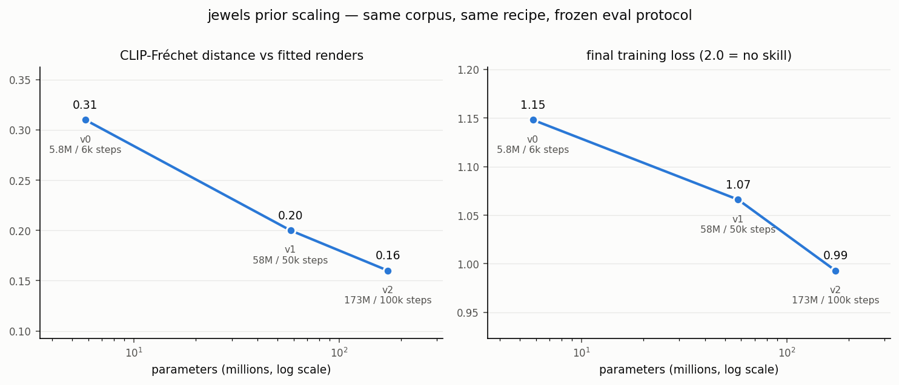

Negative experiments in this repository localize a tested architecture and training regime. A
single failed experiment is never treated as an objective law about Gaussian video generation.

## Design record

Every maintained code module has a companion Markdown document describing intent, contracts, and
rationale. The project decision log, including removed approaches and their evidence, lives in
[PROJECT.md](PROJECT.md). The pre-removal Voronoi implementation remains archived as
stprim-final-with-voronoi-20260731.tar.gz.
