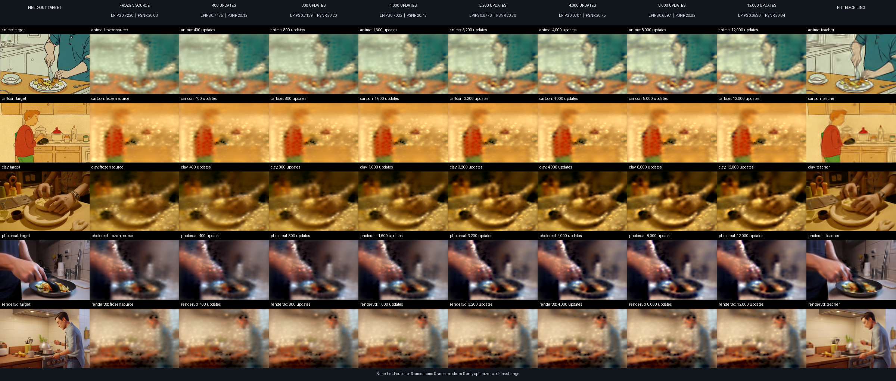

# Frozen appearance-adapter convergence v1

## Outcome

The 400-update appearance screen was undertrained. Longer controlled runs change the scientific
decision: the forced derivative-x32 adapter crosses the registered `LPIPS < 0.70` threshold between
1.6k and 3.2k updates, then independently converges to essentially the same result in two training
seeds.

| Arm / seed | 400 | 4k | 8k | 12k | 16k |
|---|---:|---:|---:|---:|---:|
| raw local, seed 0 | 0.71694 | 0.70153 | 0.69664 | 0.69559 | 0.69538 |
| derivative x32, seed 0 | 0.71745 | 0.67037 | 0.65967 | **0.65895** | — |
| derivative x32, seed 1 | — | 0.66898 | 0.66054 | **0.65953** | — |

All table values are exact LPIPS from the same five held-out clips and seven frames per clip. Final
exact PSNR is `20.83538 dB` for derivative seed 0 and `20.83497 dB` for seed 1. The two 12k runs
differ by only `0.00058 LPIPS / 0.00041 dB`. Every one of the five styles improves from the frozen
source in both derivative seeds.

This is positive proof of **compute scaling for the current mechanism**: the short screen saw only
about 3.3 training draws and 1.7 perceptual frames per clip, while 12k provides about 100 draws and
50 perceptual frames per clip. It is not yet evidence for data scaling, because corpus size remained
fixed at 120 training clips. A controlled data curve is the next experiment needed to support the
full “data and compute” claim.

## Compute curve and stopping decision

The raw-local arm improves with compute but reaches a different, weaker plateau: its exact LPIPS
moves only `0.00021` from 12k to 16k. The derivative arm improves more quickly and more strongly;
its last 4k updates change LPIPS by `0.00072` in seed 0 and `0.00100` in seed 1. These increments are
at or below the registered `0.001` material-improvement threshold, so training stopped at 12k.

This separates two effects that the short screen confounded:

- More optimization was necessary; the 400-update negative result was not a convergence result.
- The forced derivative representation is genuinely stronger; at matched 4k/8k/12k compute it
  beats raw local on both LPIPS and PSNR.

## Qualitative progression suite

The headline sheet compares frozen source, 400, 800, 1.6k, 3.2k, 4k, 8k, and 12k using the same
held-out frame and renderer. Individual full-resolution style strips are in
[`progression_styles/`](progression_styles/). The original audit-layout sheet, including the
lattice reference, is [`audit_derivative_progress_seed0/qualitative.png`](audit_derivative_progress_seed0/qualitative.png).
The independent-seed comparison is
[`audit_derivative_replication_curve/qualitative.png`](audit_derivative_replication_curve/qualitative.png).

The visible gain is gradual rather than a regime switch: stronger subject/object boundaries and
contrast emerge through roughly 4k–8k, while 8k and 12k are visually close. That agrees with the
exact curve and makes the plateau decision inspectable rather than inferred from training loss.

## Ownership and safety checks

The experiment changes only the zero-added appearance adapter. Both 12k training summaries report:

- all 20 geometry tensors bitwise identical to their frozen sources;
- all 40 non-adapter parameter tensors bitwise identical;
- fixed-validation macro PSNR of `20.88035` and `20.87512 dB` for seeds 0 and 1;
- the same irregular-field structure and active fraction (`~0.628`).

One caveat remains: sampled out-of-range RGB rises from roughly `3.4%` near the start to `6.1–6.3%`
at 12k. PSNR, SSIM, and the qualitative audit improve rather than collapse, but the next run should
add a range penalty or bounded residual parameterization and verify that the perceptual gain remains.

## Feasibility conclusion and next evidence

The result supports a pitchable but deliberately narrow conclusion: a frozen, time-distorted
irregular Gaussian field has a local appearance pathway that learns monotonically with additional
compute, crosses its preregistered quality threshold, and reproduces across optimizer seeds without
moving geometry. It does **not** yet demonstrate prompt-conditioned video generation.

The shortest path from this result to a credible text-to-video feasibility claim is:

1. Run seed 2 on fresh selection clips with the RGB-range guardrail.
2. Measure a fixed-compute data curve (for example 30/60/120 clips, then a larger diverse corpus)
   using exact unseen-prompt evaluation.
3. Condition the selected derivative appearance pathway on text and show prompt-controlled changes
   across a small, preregistered compositional prompt set.
4. Only then add child splats if the fitted-ceiling gap remains a representation bottleneck.

That sequence tests the “more data and compute” thesis directly before introducing a new mechanism
that could muddy attribution.

## Evidence inventory

- [`convergence_curves.json`](convergence_curves.json): plotted training, validation, and exact data.
- [`audit_derivative_progress_seed0/report.json`](audit_derivative_progress_seed0/report.json): dense
  seed-0 exact checkpoint audit.
- [`audit_derivative_replication_curve/report.json`](audit_derivative_replication_curve/report.json):
  shared seed-0/seed-1 exact audit.
- [`PROTOCOL.md`](PROTOCOL.md): registered hypothesis, controls, and stopping rule.
- [`EXECUTION_NOTE.md`](EXECUTION_NOTE.md): hardware, timings, and operational record.
