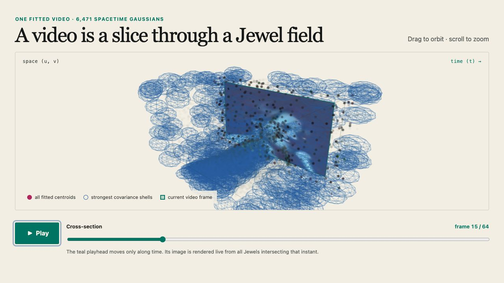

# Jewel spacetime viewer

This standalone Three.js demo loads the real 6,471-Jewel singer reconstruction used in the
explainer series. It shows the fitted field as an orbitable `(u,v,t)` volume and renders a live
fixed-time cross-section onto the moving teal playhead.



## Run it

From the repository root, regenerate the browser payload if needed:

```bash
python -m sol.export_spacetime_viewer
```

Then start the viewer:

```bash
cd sol/spacetime_viewer
npm install
npm run dev
```

Open the local address printed by Vite. Drag to orbit, scroll to zoom, scrub directly, or press
Play to advance the frame plane through time.

## What is rendered

- Every fitted centroid appears in the 3D cloud.
- The 500 strongest fitted covariance ellipsoids are shown as two-sigma wire shells so tilt remains
  readable instead of collapsing into an opaque mass.
- Every one of the 6,471 Jewels participates in the live frame slice.
- The slice uses each Jewel's conditional 2D Gaussian, time attenuation, fitted opacity, base RGB,
  and local RGB gradient.

The browser path is an explanatory positive-additive preview. Research metrics and claim-bearing
renders continue to use the PyTorch support-complete renderer.
